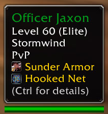
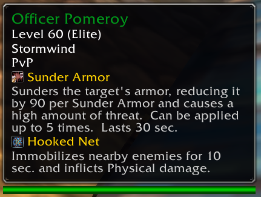

# ClassicBestiary

Displays creature ability information in the game tooltip when available. Hold Control while hovering over a unit to display descriptions for spells.

This uses a database generated via scraping Wowhead for creature abilities over the set of units in Questie's database. Some abilities reported by Wowhead like "Dazed" have been omitted, and repeated spells with similar names or tooltips have been combined.

Because of this, some ability tooltips may display incorrect values or might be missing, but if it's there it should be accurate enough to judge what it does.

